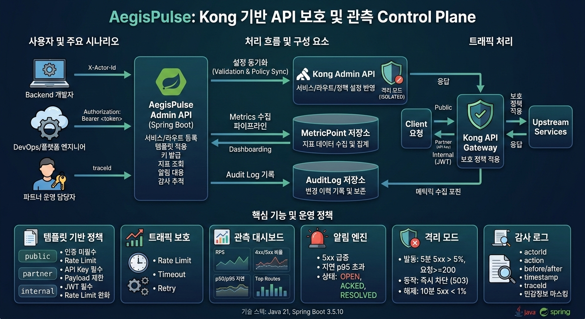

# AegisPulse

AegisPulse는 API Gateway 운영을 위한 보호 정책/관측/알림/감사 기능을 제공하는 Spring Boot 기반 Admin API 서버입니다.



## 0. 배경

API Gateway를 운영하는 조직은 서비스별로 인증, 제한, 타임아웃 정책이 제각각이고, 관측과 알림이 분리되어 있어 운영 효율이 낮다.  
AegisPulse는 Kong API Gateway 위에서 정책 표준화와 관측 자동화를 제공하는 Control Plane이다.

## 1. 핵심 기능

- 서비스 등록: `name`, `upstreamUrl`, `environment(DEV|STAGE|PROD)` 기준으로 서비스 생성
- 라우트 등록: `paths/hosts/methods/stripPath` 조합 등록 및 충돌 검증
- 템플릿 정책 적용: `public`, `partner`, `internal` 템플릿을 서비스/라우트에 적용
- Consumer/API Key: 파트너 Consumer 생성, API Key 발급(원문 1회 노출), Key 인증
- 메트릭 수집/조회: 서비스/라우트/컨슈머 축 집계와 Top Routes 조회
- 알림 엔진: 5xx 비율/p95 지연 임계치 기반 `OPEN/ACKED/RESOLVED` 상태 관리
- 격리 모드: 오류율 급증 시 자동 차단(ISOLATED), 안정화 시 자동 복구
- 감사로그: 변경 이력(before/after, actorId, traceId) 기록 및 조회
- 추적성/보안: `traceId` 전파, 구조화 접근 로그(JSON), 민감정보 마스킹

## 2. 기술 스택

- Java 21
- Spring Boot 3.5.10
- Spring Web, Validation, Spring Data JPA
- H2 (기본 런타임 DB)
- Lombok
- JUnit 5, Mockito, Spring Boot Test
- Gradle Wrapper (`./gradlew`)

## 3. 아키텍처

코드는 아래 계층 구조를 따릅니다.

- `api`: Controller, DTO, 예외/응답 규약
- `application`: 유스케이스/도메인 서비스 조합, 트랜잭션 경계
- `domain`: 핵심 모델/정책/저장소 포트
- `infra`: JPA 어댑터, 보안 구현체, 웹 필터/인터셉터, 정책 배포 어댑터

패키지 루트:

- `src/main/java/com/aegispulse`
- `src/test/java/com/aegispulse`

## 4. 빠른 시작

### 4.1 요구사항

- JDK 21+
- macOS/Linux/Windows (Gradle Wrapper 사용)

### 4.2 실행

```bash
./gradlew bootRun
```

기본 프로필은 `dev`입니다.

```bash
./gradlew bootRun --args='--spring.profiles.active=stage'
./gradlew bootRun --args='--spring.profiles.active=prod'
```

### 4.3 테스트

```bash
./gradlew test
./gradlew clean test
```

## 5. 환경 설정

기본 설정 파일:

- `src/main/resources/application.yml`
- `src/main/resources/application-dev.yml`
- `src/main/resources/application-stage.yml`
- `src/main/resources/application-prod.yml`

주요 설정:

- `spring.profiles.default=dev`
- `aegispulse.kong.admin-base-url`
  - `dev`: `http://localhost:8001`
  - `stage`: `${KONG_ADMIN_BASE_URL:https://kong-admin.stage.internal}`
  - `prod`: `${KONG_ADMIN_BASE_URL}`
- `aegispulse.alerts.evaluation-interval-ms` (기본 `60000ms`, 1분)

## 6. API 규약

### 6.1 공통 응답 포맷

성공:

```json
{
  "success": true,
  "data": {},
  "traceId": "9b4f0e5d3c7f4f8f"
}
```

실패:

```json
{
  "success": false,
  "error": {
    "code": "INVALID_REQUEST",
    "message": "잘못된 요청입니다.",
    "timestamp": "2026-03-03T00:00:00Z",
    "traceId": "9b4f0e5d3c7f4f8f"
  }
}
```

### 6.2 traceId 전파

- 요청 헤더 `X-Trace-Id`가 유효하면 그대로 사용
- 없거나 형식이 잘못되면 서버에서 새 traceId 생성
- 응답 헤더 `X-Trace-Id`와 응답 바디 `traceId`에 동일 값 포함
- 구조화 접근 로그(JSON)에 `traceId` 포함

### 6.3 주요 헤더

- `X-Actor-Id`: 라우트 등록/템플릿 적용 시 필수
- `X-API-Key`: API Key 인증 API 호출 시 필수
- `X-Trace-Id`: 선택(미지정 시 서버 생성)

## 7. 엔드포인트

| Method | Path | 설명 |
|---|---|---|
| GET | `/api/v1/health` | 헬스체크 |
| POST | `/api/v1/services` | 서비스 등록 |
| POST | `/api/v1/routes` | 라우트 등록 |
| POST | `/api/v1/policies/templates/{templateType}/apply` | 템플릿 정책 적용 |
| POST | `/api/v1/consumers` | Consumer 생성 |
| POST | `/api/v1/consumers/{consumerId}/keys` | API Key 발급(원문 1회 반환) |
| POST | `/api/v1/consumers/keys/authenticate` | API Key 인증 |
| POST | `/api/v1/internal/metrics/points:batch` | 메트릭 포인트 배치 수집 |
| GET | `/api/v1/metrics/services/{serviceId}` | 서비스 메트릭 조회 |
| GET | `/api/v1/alerts` | 알림 조회 |
| PATCH | `/api/v1/alerts/{alertId}/ack` | 알림 ACK 처리 |
| GET | `/api/v1/audit-logs` | 감사로그 조회 |

## 8. 템플릿/임계치 기본값

### 8.1 템플릿 정책

- `public`
  - 인증 없음
  - Rate Limit: `100 req/min`
  - Timeout: `connect 1000ms`, `read 3000ms`, `write 3000ms`
  - Retry: `2`, Backoff `100ms`
- `partner`
  - API Key 필수
  - Rate Limit/Timeout/Retry 기본값은 `public`과 동일
  - Payload 제한: `1MB`
- `internal`
  - JWT 필수 + `X-Internal-Client` 헤더 규칙
  - Rate Limit: `500 req/min`

### 8.2 알림/격리 규칙

- 5xx 비율 알림: 5분 평균 `> 2.0%`
- p95 지연 알림: 5분 평균 `> 800ms`
- 알림 cooldown: `10분`
- 격리 발동: 5분 5xx `> 5.0%` 이고 최소 요청 수 `>= 200`
- 격리 해제: 연속 10분(1분 포인트 10개) 동안 5xx `< 1.0%`

## 9. 예시 요청

서비스 등록:

```bash
curl -X POST http://localhost:8080/api/v1/services \
  -H 'Content-Type: application/json' \
  -d '{
    "name":"partner-payment-api",
    "upstreamUrl":"https://payment.internal.svc",
    "environment":"PROD"
  }'
```

라우트 등록:

```bash
curl -X POST http://localhost:8080/api/v1/routes \
  -H 'Content-Type: application/json' \
  -H 'X-Actor-Id: platform-admin' \
  -d '{
    "serviceId":"svc_xxx",
    "paths":["/payments"],
    "hosts":["api.example.com"],
    "methods":["GET","POST"],
    "stripPath":true
  }'
```

파트너 템플릿 적용:

```bash
curl -X POST http://localhost:8080/api/v1/policies/templates/partner/apply \
  -H 'Content-Type: application/json' \
  -H 'X-Actor-Id: platform-admin' \
  -d '{
    "serviceId":"svc_xxx",
    "routeId":"rot_xxx",
    "consumerId":"csm_xxx"
  }'
```

메트릭 조회(1시간 윈도우):

```bash
curl 'http://localhost:8080/api/v1/metrics/services/svc_xxx?window=1h'
```

## 10. 운영/보안 참고

- API Key는 저장 시 PBKDF2(`PBKDF2WithHmacSHA256`, 120,000회) 해시로만 보관
- 감사로그 `before/after`는 민감 키(`key`, `token`, `secret`, `password`, `authorization`) 자동 마스킹
- 구조화 로그는 요청 바디/토큰을 기록하지 않음
- 서비스가 `ISOLATED` 상태이면 API Key 인증보다 격리 차단이 우선 적용됨

## 11. 현재 구현 범위 메모

- 정책 배포 포트는 현재 `NoopPolicyDeploymentAdapter`로 연결되어 있어, 외부 게이트웨이(Kong) 반영은 no-op 동작입니다.
- 관리자 인증 토큰(Bearer) 강제 검증은 아직 추가되지 않았습니다.
